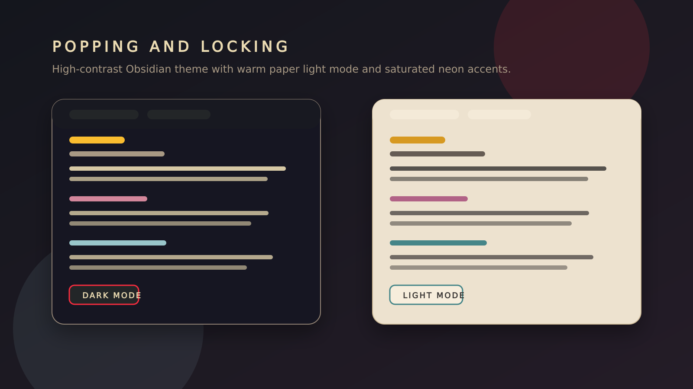

## Popping and Locking

Popping and Locking is an Obsidian theme with a punchy retro palette, high-contrast headings, and a warm paper-toned light mode paired with a deeper club-lit dark mode.

## Preview



## Highlights

- Dark and light mode support.
- Gruvbox-inspired accents with stronger contrast for active tabs, file states, and headings.
- Uppercase navigation and tab styling for a more rhythmic, editorial layout.
- Clear heading hierarchy and code block contrast in both modes.

## Installation

### Community themes

Once the theme is accepted into the Obsidian community themes directory, enable it from `Settings -> Appearance -> Community themes`.

### Manual install

1. Open your vault's `.obsidian/themes/` folder.
2. Create a folder named `Popping and Locking`.
3. Copy `manifest.json` and `theme.css` into that folder.
4. Select `Popping and Locking` in Obsidian under `Settings -> Appearance`.

## Release process

1. Run `npm version <version> --no-git-tag-version`.
2. Commit the updated `package.json`, `manifest.json`, and `versions.json`.
3. Create a Git tag that exactly matches the theme version, for example `git tag 1.0.1`.
4. Push the commit and tag.
5. The GitHub Actions workflow publishes a release with `manifest.json` and `theme.css` attached.

## Community theme submission

Submit a pull request to `obsidianmd/obsidian-releases` adding an entry to `community-css-themes.json` like this:

```json
{
  "name": "Popping and Locking",
  "author": "jfrye",
  "repo": "randoneering/popping-locking-obsidian-theme",
  "screenshot": "assets/popping-locking-preview.png",
  "modes": ["dark", "light"]
}
```
